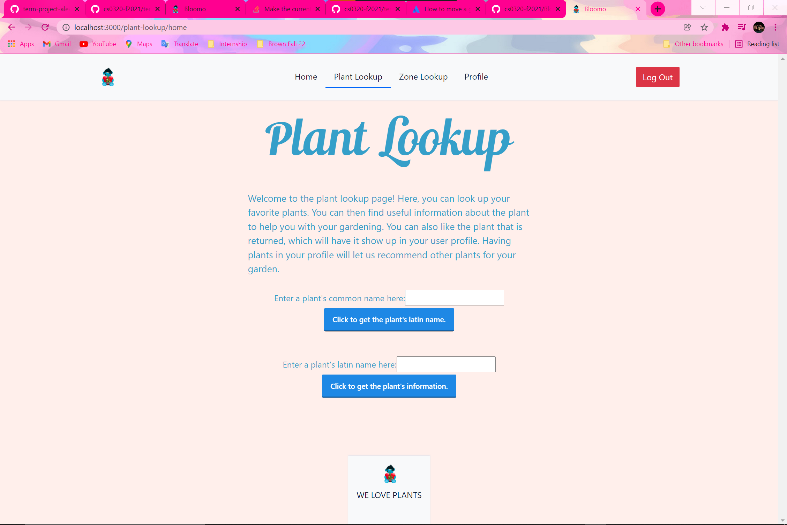
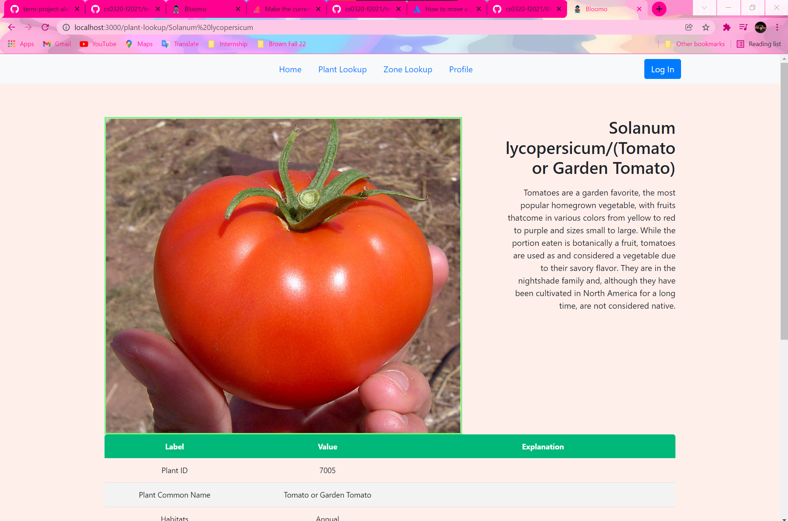
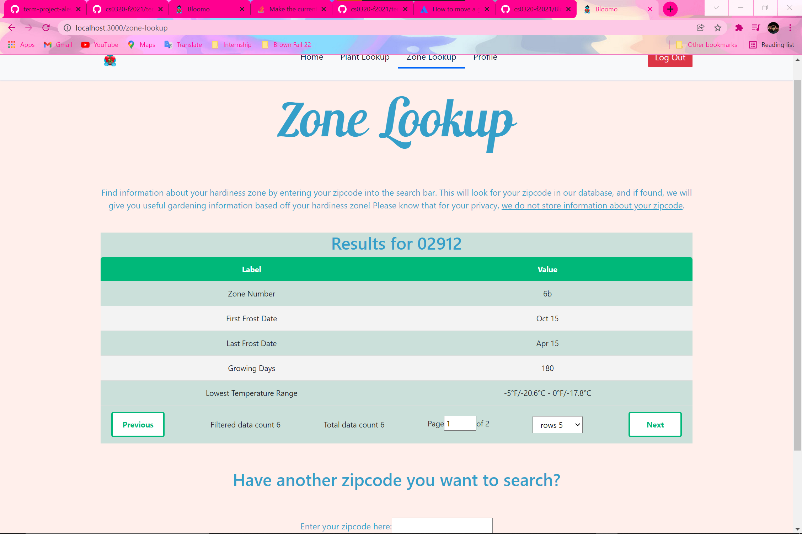
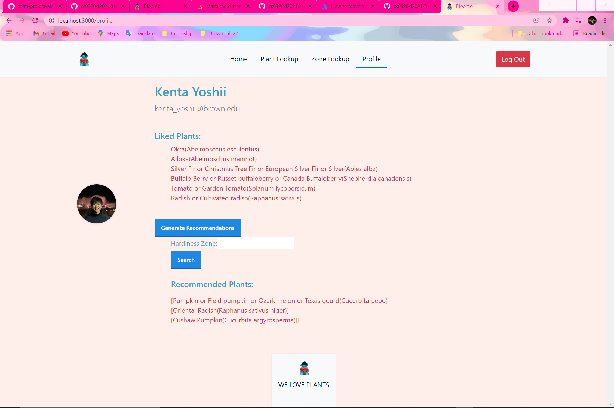
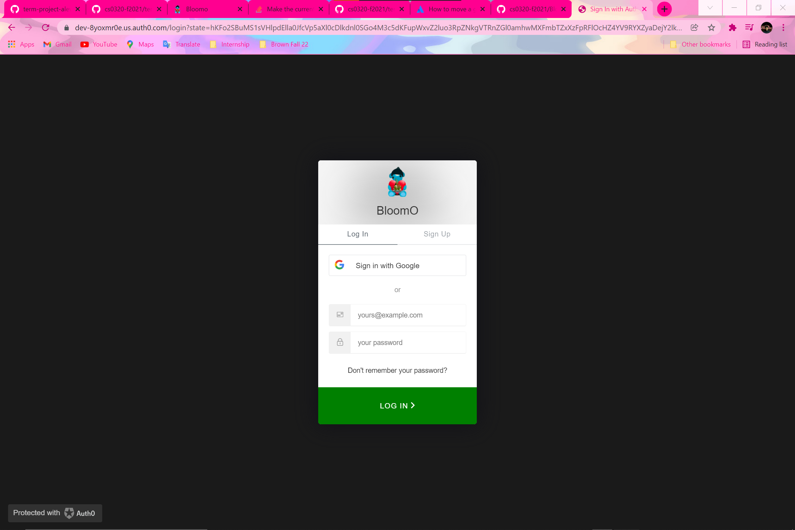
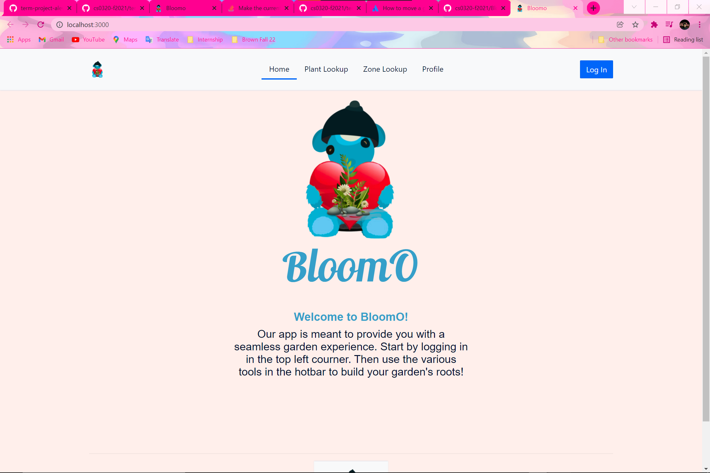

# BloomO

## **How to Build and Run**
To host the website, do the following command:

```shell
cd plant-app

npm start
```

To Run the REPL, do the following command:

```shell
mvn package

./run      <- start the repl

plant_zone <zipcode>      <- get the zone information for a zipcode

input_plant_image <name of plant>      <- get the image link in url form of an input plant 

input_plant_image_robust <- get the image link in url form from another endpoint

plant_load <path to csv file>


```

## BloomO

- `Overview`
  - a website or app that has the following functionalities
  
    1. __Plant Lookup__
       - If the plant is not in the database, user can add it by providing the appropriate information
    
    
    2. __Zone lookup__
       - The user can search for a zone by providing the longitude and latitude (or zip code). 
       - Zone information, city, state, and other characteristics are will be returned and displayed.
       
    3. __Plant Recommendation__
       - A user can get plants recommendations by providing the zone number.
       - A user can get plants recommendations by providing a plant name.
       - A user can get plants recommendations based on their previously planted plants.
       
    4. __User Login__
       - A user can login to the website by providing their userId and password.
       - A user can then personalize in a sense that they can like any plants they like and get plant recommendations based off that.
       
       

  

